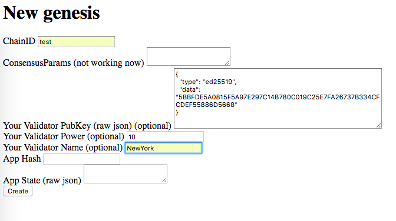

# Alpha

Tiny web app to help you form a genesis file



## Run it on your server

```
wget https://github.com/tendermint/alpha/raw/master/alpha.go && go run alpha.go
```

If that failed with something like `cannot use pubKey ... as type`, remove
`$GOPATH/src/github.com/tendermint/go-crypto` or run it inside a Docker
container.

## Advantages

- no logs
- open-source
- 200 lines of code
- single file

## Docker

Build docker:

```
CGO_ENABLED=0 GOOS=linux go build -ldflags "-s -w" -o alpha
docker build -t "your_account/alpha" .
```
